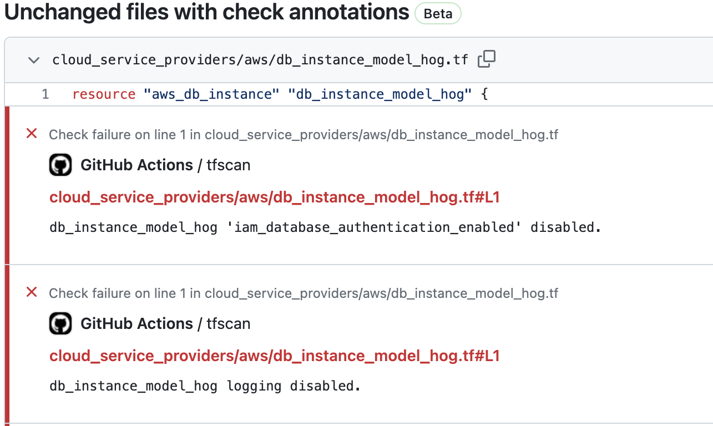

# Steampipe IaC Action

[](https://steampipe.io/?utm_source=github&utm_medium=organic_oss&utm_campaign=polygoat) &nbsp;
[](https://hub.steampipe.io/mods/turbot/terraform_aws_compliance) &nbsp;
[](https://hub.steampipe.io/mods/turbot/terraform_azure_compliance) &nbsp;
[](https://hub.steampipe.io/mods/turbot/terraform_gcp_compliance) &nbsp;
[](https://hub.steampipe.io/mods/turbot/terraform_oci_compliance) &nbsp;
 &nbsp;

## Integrate Steampipe IaC to your GitHub workflows

The Steampipe IaC action allows you to scan your Infrastructure as Code (IaC) files written in Terraform directly from your GitHub repository using your workflow pipeline. This helps to identify potential security vulnerabilities, compliance issues, and infrastructure misconfigurations early in the development cycle.

## Getting started

To get started with scanning your AWS Terraform resources, add the following steps to your workflow file.

```yaml
steps:
  ...
  - name: Setup Steampipe
    uses: turbot/setup-steampipe
    with:
      connections: |
        connection "terraform" {
          paths = [ "./**/*.tf" ]
        }

  - name: Run AWS compliance on Terraform resources
    uses: turbot/steampipe-iac-action
    with:
      mod_url: https://github.com/turbot/steampipe-mod-terraform-aws-compliance.git
```

This does two things:

1. Uses the [`setup-steampipe` action](https://github.com/turbot/steampipe-action-setup) to setup Steampipe, along with the necessary plugins in your job environment.
2. Runs the AWS Terraform compliance [mod](#whats-a-mod_url) using this action in the subsequent step.

> For more information on how to use the `steampipe-action-setup` action, refer to its [README](https://github.com/turbot/steampipe-action-setup).

## Usage

```yaml
- name: Scan Terraform AWS resources
  uses: turbot/steampipe-iac-action
  with:
    # The `mod_repository` is the URL to a (git)cloneable mod respository. This is passed **verbatim** to # `git clone`.
    # To know more about Steampipe mods, head over to [this page](https://steampipe.io/docs/mods/overview#steampipe-mods).
    #
    # required
    mod_repository: https://github.com/turbot/steampipe-mod-terraform-aws-compliance.git

    # The branch in `mod_repository` to checkout after cloning.
    #
    # If not specified, this defaults to the active branch in `mod_repository`
    #
    # default: `remote active branch`
    mod_branch:

    # A list of benchmarks and controls to run (multi-line).
    # If not specified it runs all benchmarks and controls in the mod.
    #
    # default: all
    checks: |
      benchmark.kms
      benchmark.ebs
      benchmark.apigateway
      control.ecs_cluster_container_insights_enabled
      control.ecs_task_definition_encryption_in_transit_enabled

    # Set a prefix to the current search path (comma-separated).
    search_path_prefix: aws_tf

    # Personal access token (PAT) used to push annotations and job summary
    #
    # We recommend using a service account with the least permissions necessary. Also
    # when generating a new PAT, select the least scopes necessary.
    #
    # [Learn more about creating and using encrypted secrets](https://help.github.com/en/actions/automating-your-workflow-with-github-actions/creating-and-using-encrypted-secrets)
    #
    # Default: ${{ github.token }}
    github_token: ${{ github.token }}
```

## Mods from the [steampipe.io](https://steampipe.io) team

The Steampipe team offers some mods that can help you to hit the ground running with [scanning Terraform resources](https://hub.steampipe.io/mods?q=terraform%20compliance) for the cloud provider you prefer.

| Provider                                                                 | `mod_url`                                                              |
| ------------------------------------------------------------------------ | ---------------------------------------------------------------------- |
| [Azure](https://hub.steampipe.io/mods/turbot/terraform_azure_compliance) | https://github.com/turbot/steampipe-mod-terraform-azure-compliance.git |
| [GCP](https://hub.steampipe.io/mods/turbot/terraform_gcp_compliance)     | https://github.com/turbot/steampipe-mod-terraform-gcp-compliance.git   |
| [OCI](https://hub.steampipe.io/mods/turbot/terraform_oci_compliance)     | https://github.com/turbot/steampipe-mod-terraform-oci-compliance.git   |
| [AWS](https://hub.steampipe.io/mods/turbot/terraform_aws_compliance)     | https://github.com/turbot/steampipe-mod-terraform-aws-compliance.git   |

## Annotations and summary

The action annotates your repository files with any `alarms` encountered in the scan if the action is triggered by a Pull Request.



The action also produces an easy-to-read summary of the scan and pushes it to the **Job Summary**.


If you have created your own `mod`, you can still benefit from `annotations`, as long as a `control` has a `dimension` value with a `filepath:linenumber` pattern, where `filepath` resolves to a file in the repository.

## Scenarios

- [Run a specific benchmark or control with the `checks` input.](#run-a-specific-benchmark-or-control-with-the-checks-input)
- [Run multiple benchmarks and controls with the `checks` input.](#run-multiple-benchmarks-and-controls-with-the-checks-input)
- [Specify the path to locate Terraform files to scan, with the `paths` input.](#specify-the-path-to-locate-terraform-files-to-scan-with-the-paths-input)
- [Specify multiple paths to locate Terraform files to scan, with the `paths` input.](#specify-multiple-paths-to-locate-terraform-files-to-scan-with-the-paths-input)
- [Use the action multiple times to scan multi-cloud Terraform resources in the same job](#use-the-action-multiple-times-to-scan-multi-cloud-terraform-resources-in-the-same-job)

## Utilize OIDC to access authenticate with short lived creds in AWS and GCP

### Prerequisites

The projects and roles you enable these changes for in your public clouds, should have read only access to the resources you intend to interrogate with steampipe. A prevalidation step of setting your OIDC connection up with your own provider is encouraged, to ensure no miss configuration occurs on the client side.

#### GCP
All you need is a configured connection with the project id and service account, with landing repo where you an allowed client. Just pass these in as inputs to our workflows!

#### AWS

Just specify the full aws account role  

##### Future work

Fully deploying the OIDC connection into one or more clouds is in future scope but not currently supported.

### Run a specific benchmark or control with the `checks` input.

```yaml
name: Run Steampipe Terraform AWS Compliance
uses: turbot/steampipe-iac-action
with:
  mod_url: "https://github.com/turbot/steampipe-mod-terraform-aws-compliance.git"
  checks: benchmark.kms
```

> Refer to the benchmarks/controls available for your cloud provider [here](#helpful-links)

### Run multiple benchmarks and controls with the `checks` input.

```yaml
name: Run Steampipe Terraform AWS Compliance
uses: turbot/steampipe-iac-action
with:
  mod_url: "https://github.com/turbot/steampipe-mod-terraform-aws-compliance.git"
  checks: |
    benchmark.kms
    benchmark.ebs
    benchmark.apigateway
    control.ecs_cluster_container_insights_enabled
    control.ecs_task_definition_encryption_in_transit_enabled
```

### Specify multiple paths to locate Terraform files to scan, with the `paths` input.

```yaml
steps:
  ...
  - name: Setup Steampipe
    uses: turbot/setup-steampipe
    with:
      connections: |
        connection "terraform" {
          paths = [ "cloud_infra/service_billing/aws/**/*.tf", "cloud_infra/service_orders/aws/**/*.tf" ]
        }
  - name: Scan Terraform aws resources
    uses: turbot/steampipe-iac-action
    with:
      mod_url: https://github.com/turbot/steampipe-mod-terraform-aws-compliance.git
```

> Refer to https://hub.steampipe.io/plugins/turbot/terraform#configuring-local-file-paths for local file path configuration.

### Use the action multiple times to scan multi-cloud Terraform resources in the same job

```yaml

steps:
  ...
  - name: Setup Steampipe
    uses: turbot/setup-steampipe
    with:
      connections: |
        connection "aws_tf" {
          paths = [ "cloud_infra/service_billing/aws/**/*.tf", "cloud_infra/service_orders/aws/**/*.tf" ]
        }

        connection "gcp_tf" {
          paths = [ "cloud_infra/service_billing/gcp/**/*.tf", "cloud_infra/service_orders/gcp/**/*.tf" ]
        }

  - name: Run Steampipe Terraform Compliance on AWS
    uses: turbot/steampipe-iac-action
    with:
      mod_url: https://github.com/turbot/steampipe-mod-terraform-aws-compliance.git

  - name: Run Steampipe Terraform Compliance on GCP
    uses: turbot/steampipe-iac-action
    with:
      mod_url: https://github.com/turbot/steampipe-mod-terraform-gcp-compliance.git
      search_path_prefix: gcp_tf # gives preference to the gcp terraform files
```

For more examples refer to the [`examples/workflow`](/examples/workflow) directory.

### Helpful links

- [Terraform AWS Compliance benchmarks](https://hub.steampipe.io/mods/turbot/terraform_aws_compliance/controls#benchmarks)
- [Terraform Azure Compliance benchmarks](https://hub.steampipe.io/mods/turbot/terraform_azure_compliance/controls#benchmarks)
- [Terraform GCP Compliance benchmarks](https://hub.steampipe.io/mods/turbot/terraform_gcp_compliance/controls#benchmarks)
- [Terraform OCI Compliance benchmarks](https://hub.steampipe.io/mods/turbot/terraform_oci_compliance/controls#benchmarks)
- [Supported Terraform path formats](https://hub.steampipe.io/plugins/turbot/terraform#supported-path-formats)
