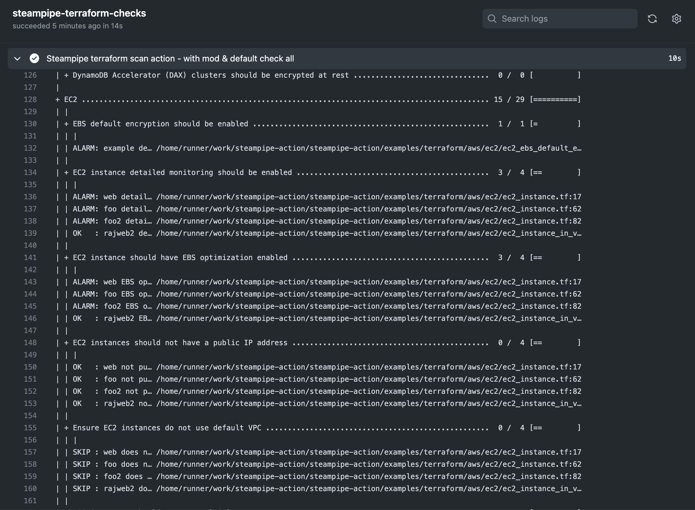
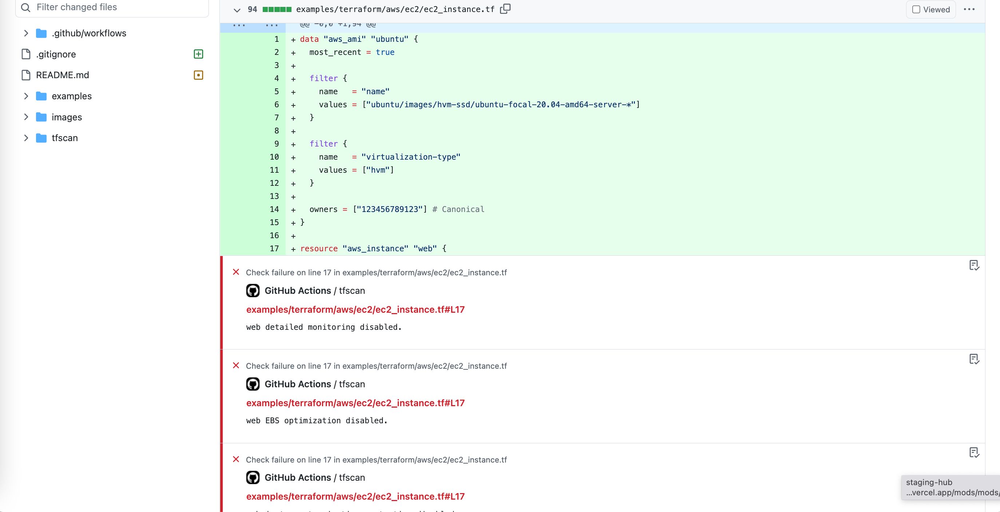
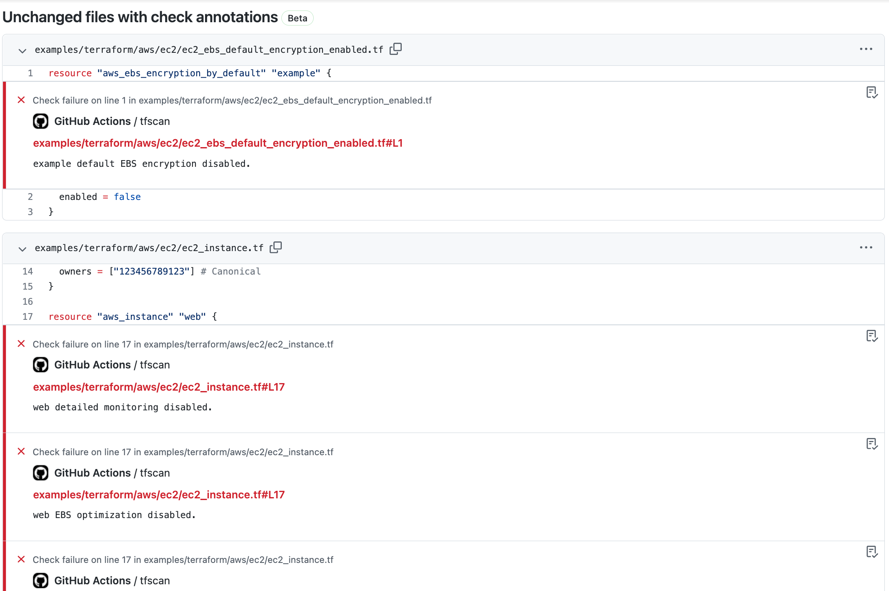

# Steampipe GitHub Action

[](https://steampipe.io/?utm_source=github&utm_medium=organic_oss&utm_campaign=polygoat) &nbsp;
[](https://hub.steampipe.io/mods/turbot/terraform_aws_compliance) &nbsp;
[](https://hub.steampipe.io/mods/turbot/terraform_azure_compliance) &nbsp;
[](https://hub.steampipe.io/mods/turbot/terraform_gcp_compliance) &nbsp;
[](https://hub.steampipe.io/mods/turbot/terraform_oci_compliance) &nbsp;
  &nbsp;

Steampipe GitHub action is used for scanning infrastructure-as-code checks in your GitHub workflow pipeline. By utilizing this GitHub action, you can automatically start to monitor your project for configuration issues in Terraform.

**Note** Currently it supports [AWS](https://hub.steampipe.io/mods/turbot/terraform_aws_compliance), [Azure](https://hub.steampipe.io/mods/turbot/terraform_azure_compliance), [GCP](https://hub.steampipe.io/mods/turbot/terraform_gcp_compliance) and [OCI](https://hub.steampipe.io/mods/turbot/terraform_oci_compliance) terraform configuration checks.

## How to use the Steampipe GitHub Action

It is very easy to start using the GitHub action.

All you need to do is:

1. Follow the instructions at [GitHub configuration a workflow](https://help.github.com/en/actions/configuring-and-managing-workflows/configuring-a-workflow) to enable GitHub Action in your repository.
2. The workflow `uses` the `turbot/steampipe-iac-action`.
3. Optionally, provide parameters to customize GitHub action behaviors.

## Usage Examples

### Scan IaC in your repository

```yaml
name: Run Steampipe Checks
on:
  push:
    branches:
      - main
  pull_request:

jobs:
  steampipe-terraform-checks:
    runs-on: ubuntu-latest

    steps:
      - name: Check out repository
        uses: actions/checkout@v3

      - name: Steampipe terraform scan action
        uses: turbot/steampipe-action/tfscan
        with:
          mod: 'https://github.com/turbot/steampipe-mod-terraform-aws-compliance.git'
```
**AWS terraform compliance mod used in the above workflow example*

More examples are provided in `examples/workflow` starting with `terraform_aws_compliance.yml`.

## GitHub action Parameters

| Parameter  | Description | Required | Default | Type |
| -----------| -------------------------------------------------------------------------------------------------------- | ------------- | ------------- | ------------- |
| mod | Git URL of a [mod](https://hub.steampipe.io/mods?q=terraform) that will be installed. This will be passed on to `git clone` | Yes | | Input parameters |
| paths | xxx | No | . | Input parameters |
| figure-out-name | A list of controls to run (space-separated). If no value is specified, it runs `check all` | No | check all | Input parameters |
| version | The version number of Steampipe that will be installed | No | latest | Input parameters |

## Example Screenshots

Action with successful execution


Action with annotation


Action with unchanged file

