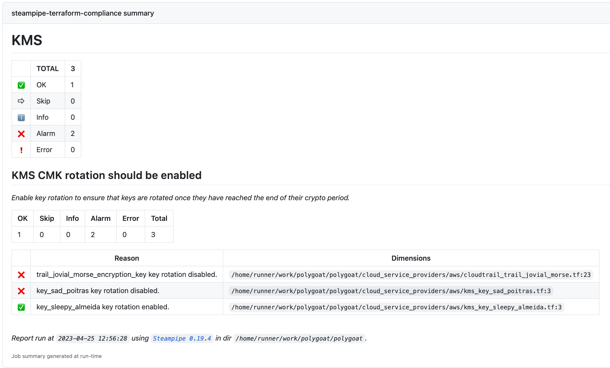

# Steampipe Check for GitHub Actions

This action runs [Steampipe](https://steampipe.io/) benchmarks and controls from [Steampipe Mods](https://hub.steampipe.io/mods).



When running checks for Infrastructure as Code (IaC) mods, this action will create annotations for any controls in `alarm` state provided they have an [additional dimension](https://steampipe.io/docs/reference/mod-resources/control#additional-control-columns--dimensions) providing the file path and a start line number in one of the following formats: `path/filename.ext:23` or `path/name.ext:23-25`.

> Note: In order to create annotations, the workflow job requires `checks: write` and `pull-requests: write` [permissions](https://docs.github.com/en/actions/using-jobs/assigning-permissions-to-jobs).

For a list of IaC mods, please see [IaC mods](https://hub.steampipe.io/mods?categories=iac).


## Usage

See [action.yml](action.yml).

## Examples

### Run all Terraform AWS controls

```yaml
  - name: Checkout repo
    uses: actions/checkout@v4

  - name: Setup Steampipe
    uses: turbot/steampipe-action-setup@v1
    with:
      plugin-connections: |
        connection "terraform" {
          plugin = "terraform"
          configuration_file_paths = [ "./**/*.tf" ]
        }

  - name: Run all Terraform AWS Compliance checks
    uses: turbot/steampipe-action-check@v1
    with:
      mod-url: https://github.com/turbot/steampipe-mod-terraform-aws-compliance
```

### Run specific benchmarks and controls

```yaml
  - name: Checkout repo
    uses: actions/checkout@v4

  - name: Setup Steampipe
    uses: turbot/steampipe-action-setup@v1
    with:
      plugin-connections: |
        connection "terraform" {
          plugin = "terraform"
          configuration_file_paths = [ "./**/*.tf" ]
        }

  - name: Run specific Terraform AWS Compliance checks
    uses: turbot/steampipe-action-check@v1
    with:
      mod-url: https://github.com/turbot/steampipe-mod-terraform-aws-compliance
      mod-checks: |
        benchmark.s3
        benchmark.kms
        control.ecs_task_definition_encryption_in_transit_enabled
```

### Run benchmarks and controls from multiple mods

```yaml
  - name: Checkout repo
    uses: actions/checkout@v4

  - name: Setup Steampipe
    uses: turbot/steampipe-action-setup@v1
    with:
      plugin-connections: |
        connection "aws_tf" {
          plugin = "terraform"
          configuration_file_paths = [
            "cloud_infra/service_billing/aws/**/*.tf",
            "cloud_infra/service_orders/aws/**/*.tf"
          ]
        }

        connection "gcp_tf" {
          plugin = "terraform"
          configuration_file_paths = [
            "cloud_infra/service_billing/gcp/**/*.tf",
            "cloud_infra/service_orders/gcp/**/*.tf"
          ]
        }

  - name: Run Terraform AWS Compliance checks
    uses: turbot/steampipe-action-check@v1
    with:
      mod-url: https://github.com/turbot/steampipe-mod-terraform-aws-compliance
      additional-args: '--search-path-prefix=aws_tf'

  - name: Run GCP Terraform Compliance checks
    uses: turbot/steampipe-action-check@v1
    with:
      mod-url: https://github.com/turbot/steampipe-mod-terraform-gcp-compliance
      additional-args: '--search-path-prefix=gcp_tf'
```

### Use a specific tag version of a mod

```yaml
  - name: Checkout repo
    uses: actions/checkout@v4

  - name: Setup Steampipe
    uses: turbot/steampipe-action-setup@v1
    with:
      plugin-connections: |
        connection "terraform" {
          plugin = "terraform"
          configuration_file_paths = [ "./**/*.tf" ]
        }

  - name: Run Terraform AWS Compliance v0.18 checks
    uses: turbot/steampipe-action-check@v1
    with:
      mod-url: https://github.com/turbot/steampipe-mod-terraform-aws-compliance
      mod-branch: v0.18
```

### Run GitHub Compliance checks

This action can also be used to run benchmarks and controls in mods that don't scan IaC configuration files.

```yaml
  - name: Checkout repo
    uses: actions/checkout@v4

  - name: Setup Steampipe
    uses: turbot/steampipe-action-setup@v1
    with:
      plugin-connections: |
        connection "github" {
          plugin = "github"
          token  = "${{ secrets.GITHUB_PAT }}"
        }

  - name: Steampipe Checks
    uses: turbot/steampipe-action-check@v1
    with:
      mod-url: https://github.com/turbot/steampipe-mod-github-compliance
      mod-checks: benchmark.cis_supply_chain_v100
```

### Run AWS CIS v2.0.0 benchmark

This example uses an [IAM OIDC identity provider](https://aws.amazon.com/blogs/security/use-iam-roles-to-connect-github-actions-to-actions-in-aws/) with an IAM role.

> Note: In order to use OIDC the workflow job will require `id-token: write` permissions. For more information, please see [Adding permission settings](https://docs.github.com/en/actions/deployment/security-hardening-your-deployments/configuring-openid-connect-in-amazon-web-services#adding-permissions-settings).


```yaml
steps:
  - name: Checkout repo
    uses: actions/checkout@v4

  - name: Setup AWS Credentials
    uses: aws-actions/configure-aws-credentials@v4
    with:
      role-to-assume: arn:aws:iam::1234567890:role/my-role
      aws-region: us-east-1

  - name: Setup Steampipe
    uses: turbot/steampipe-action-setup@v1
    with:
      plugin-connections: |
        connection "aws" {
          plugin = "aws"
        }

  - name: Steampipe Checks
    uses: turbot/steampipe-action-check@v1
    with:
      mod-url: https://github.com/turbot/steampipe-mod-aws-compliance
      mod-checks: benchmark.cis_v200
```

### Create Turbot Pipes snapshot

The check results can also be created and uploaded as snapshots to [Turbot Pipes](https://turbot.com/pipes).

A snapshot is a saved view of benchmark and control results and may be shared with other Turbot Pipes users or with anyone that has the link.

Snapshot visibility is set by the `pipes-snapshot-visibility` input:
  - `anyone_with_link` - Snapshot is shareable with anyone.
  - `workspace` - Snapshot is created in the user's default workspace. To save the snapshot to a different location, use `--snapshot-location` in the `additional-args` input.

```yaml
  - name: Checkout repo
    uses: actions/checkout@v4

  - name: Setup Steampipe
    uses: turbot/steampipe-action-setup@v1
    with:
      plugin-connections: |
        connection "terraform" {
          plugin = "terraform"
          configuration_file_paths = [ "./**/*.tf" ]
        }

  - name: Run AWS compliance on Terraform resources
    uses: turbot/steampipe-action-check@v1
    with:
      mod-url: https://github.com/turbot/steampipe-mod-terraform-aws-compliance
      pipes-snapshot-visibility: workspace
      pipes-token: ${{ secrets.PIPES_TOKEN }}
```

### Pass in Steampipe variables

Variables can be passed into Steampipe multiple ways, for more information on how to pass in variables and what order they're loaded in, please see [Passing Input Variables](https://steampipe.io/docs/mods/mod-variables#passing-input-variables).


```yaml
  - name: Checkout repo
    uses: actions/checkout@v4

  - name: Setup AWS Credentials
    uses: aws-actions/configure-aws-credentials@v4
    with:
      role-to-assume: arn:aws:iam::1234567890:role/my-role
      aws-region: us-east-1

  - name: Setup Steampipe
    uses: turbot/steampipe-action-setup@v1
    with:
      plugin-connections: |
        connection "aws" {
          plugin = "aws"
        }

  - name: Run AWS Tags checks
    uses: turbot/steampipe-action-check@v1
    env:
      # Variables can be passed in through env vars
      SP_VAR_mandatory_tags: '["Application", "Environment", "Department", "Owner"]'
    with:
      mod-url: https://github.com/turbot/steampipe-mod-aws-tagsompliance
      # Or with CLI flags
      additional-args: "--var 'prohibited_tags=[\"Password\", \"Key\"]'"
```

## Advanced Examples

### Run checks in a Turbot Pipes workspace

You can execute queries via Turbot Pipes, which is useful if you already have plugin connections setup in your workspaces.

The following example shows how to specify an [implicit workspace](https://steampipe.io/docs/managing/workspaces#implicit-workspaces) within the `additional-args` input.

```yaml
steps:
  - name: Checkout repo
    uses: actions/checkout@v4

  - name: Setup Steampipe
    uses: turbot/steampipe-action-setup@v1
    with:
      plugin-connections: |
        connection "aws" {
          plugin = "aws"
        }

  - name: Steampipe Checks
    uses: turbot/steampipe-action-check@v1
    with:
      mod-url: https://github.com/turbot/steampipe-mod-aws-compliance
      pipes-token: ${{ secrets.PIPES_TOKEN }}
      pipes-snapshot-visibility: workspace
      # The workspace passed here in format <owner>/<workspace> needs to be accessible by your pipes-token
      additional-args: '--workspace="username/default"'
```

You can also set the workspace via the `STEAMPIPE_WORKSPACE` environment variable.

```yaml
  - name: Steampipe Checks
    uses: turbot/steampipe-action-check@v1
    env:
      STEAMPIPE_WORKSPACE: 'username/default'
    with:
      mod-url: https://github.com/turbot/steampipe-mod-aws-compliance
      pipes-token: ${{ secrets.PIPES_TOKEN }}
      pipes-snapshot-visibility: workspace
```

### Use a matrix to run checks from multiple mods

```yaml
jobs:
  steampipe-terraform-compliance:
    strategy:
      matrix:
        include:
          - cloud: "aws"
            search_path: "aws_tf"
          - cloud: "azure"
            search_path: "azure_tf"
          - cloud: "gcp"
            search_path: "gcp_tf"
    runs-on: ubuntu-latest
    steps:
      - name: Checkout repo
        uses: actions/checkout@v4

      - name: Setup Steampipe
        uses: turbot/steampipe-action-setup@v1
        with:
          plugin-connections: |
            connection "aws_tf" {
              plugin = "terraform"
              configuration_file_paths = ["cloud_infra/terraform/aws/**/*.tf"]
            }
            connection "gcp_tf" {
              plugin = "terraform"
              configuration_file_paths = ["cloud_infra/terraform/gcp/**/*.tf"]
            }
            connection "azure_tf" {
              plugin = "terraform"
              configuration_file_paths = ["cloud_infra/terraform/azure/**/*.tf"]
            }

      - name: Run Terraform ${{ matrix.cloud }} Compliance
        uses: turbot/steampipe-action-check@v1
        with:
          mod-url: 'https://github.com/turbot/steampipe-mod-terraform-${{ matrix.cloud }}-compliance'
          additional-args: '--search-path-prefix=${{ matrix.search_path }}'
```

## Helpful links

- [Steampipe docs](https://steampipe.io/docs)
- [Steampipe plugins](https://hub.steampipe.io/plugins)
- [Steampipe mods](https://hub.steampipe.io/mods)
