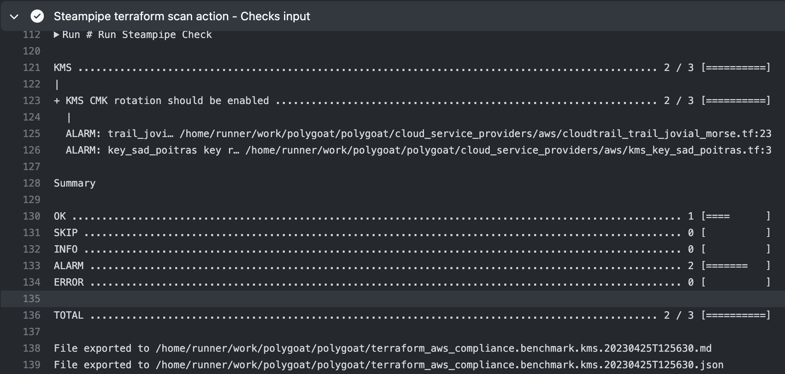
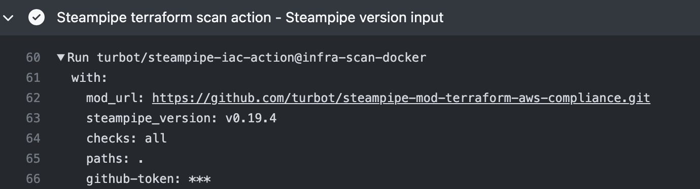

# Steampipe IaC Action

[](https://steampipe.io/?utm_source=github&utm_medium=organic_oss&utm_campaign=polygoat) &nbsp;
[](https://hub.steampipe.io/mods/turbot/terraform_aws_compliance) &nbsp;
[](https://hub.steampipe.io/mods/turbot/terraform_azure_compliance) &nbsp;
[](https://hub.steampipe.io/mods/turbot/terraform_gcp_compliance) &nbsp;
[](https://hub.steampipe.io/mods/turbot/terraform_oci_compliance) &nbsp;
  &nbsp;

## Integrate Steampipe IaC action into your GitHub workflows

The Steampipe IaC action enables scanning your Infrastructure as Code (IaC) configuration files directly from the repository using your GitHub workflow pipeline. This enables you to proactively identify potential security vulnerabilities, compliance issues, and infrastructure misconfigurations.

### Pre-requisite

Enable and [configure GitHub Action](https://help.github.com/en/actions/configuring-and-managing-workflows/configuring-a-workflow) in your repository.

## Getting started

To get started with scanning your AWS Terraform resources, add the following step to your workflow file.

```yaml
steps:
  ...
  - name: Scan Terraform aws resources
    uses: turbot/steampipe-iac-action
    with:
      mod_url: https://github.com/turbot/steampipe-mod-terraform-aws-compliance.git
```

This uses the `turbot/steampipe-iac-action` action and scans all Terraform files in your repository containing AWS resources.

## Supported cloud providers

You can adjust the **`mod_url`** parameter to perform a scan on Terraform resources of other supported cloud providers.

| Provider  | `mod_url` |
| -----------| ------------------------------------------------------------- |
| [Azure](https://hub.steampipe.io/mods/turbot/terraform_azure_compliance) | https://github.com/turbot/steampipe-mod-terraform-azure-compliance.git |
| [GCP](https://hub.steampipe.io/mods/turbot/terraform_gcp_compliance) | https://github.com/turbot/steampipe-mod-terraform-gcp-compliance.git |
| [OCI](https://hub.steampipe.io/mods/turbot/terraform_oci_compliance ) | https://github.com/turbot/steampipe-mod-terraform-oci-compliance.git |
| [AWS](https://hub.steampipe.io/mods/turbot/terraform_aws_compliance ) | https://github.com/turbot/steampipe-mod-terraform-aws-compliance.git |

## Optional inputs

You can provide additional parameters to customize the action.

| Parameter  | Description | Required | Default |
| -----------| -------------------------------------------------------------------------------------------------------- | ------------- | ------------- |
| mod_url | URL of the [terraform compliance mod]((https://hub.steampipe.io/mods?q=terraform)) to be installed. This will be passed on to `git clone` | Yes | - |
| github-token | Token is used to generate annotations. <br> `Note`: The GitHub token must have permissions to create annotations. | No | `GITHUB_TOKEN` |
| paths | List of globs to search for Terraform configuration files (comma-separated). | No | Repository root |
| checks | List of benchmarks and controls to run (space-separated or multi-line). | No | all |
| steampipe_version | Steampipe version to install. For available versions refer to [Steampipe Releases](https://github.com/turbot/steampipe/releases) | No | latest |

## Optional input examples

1. To run specific benchmarks and controls, include the `checks` input.

```yaml
name: Run Steampipe Terraform AWS Compliance
uses: turbot/steampipe-iac-action
with:
  mod_url: 'https://github.com/turbot/steampipe-mod-terraform-aws-compliance.git'
  checks: |
    benchmark.kms
    benchmark.apigateway
    benchmark.ebs
```

> Refer to the benchmarks/controls available for your cloud provider [here](#supported-cloud-providers)

 <br>

2. Pin the Steampipe version to be installed with the `steampipe_version` input.

```yaml
name: Run Steampipe Terraform Compliance
uses: turbot/steampipe-iac-action
with:
  mod_url: 'https://github.com/turbot/steampipe-mod-terraform-aws-compliance.git'
  steampipe_version: v0.19.4
```


3. Specify the Terraform files to scan with the `paths` input.

```yaml
name: Run Steampipe Terraform Compliance
uses: turbot/steampipe-iac-action
with:
  mod_url: https://github.com/turbot/steampipe-mod-terraform-aws-compliance.git
  path: examples/terraform//**.tf # Relative to repository root
```

> Refer to https://hub.steampipe.io/plugins/turbot/terraform#configuring-local-file-paths for local file path configuration.

Samples with customized parameters can be found in the `examples/workflow` folder, which you can refer to.

## Annotations

On successful scans, checks configured to run against changed files in a pull request provide annotations showing details about the code with errors and alarms.


### Helpful links
- [Terraform AWS Compliance benchmarks](https://hub.steampipe.io/mods/turbot/terraform_aws_compliance/controls#benchmarks)
- [Terraform Azure Compliance benchmarks](https://hub.steampipe.io/mods/turbot/terraform_azure_compliance/controls#benchmarks)
- [Terraform GCP Compliance benchmarks](https://hub.steampipe.io/mods/turbot/terraform_gcp_compliance/controls#benchmarks)
- [Terraform OCI Compliance benchmarks](https://hub.steampipe.io/mods/turbot/terraform_oci_compliance/controls#benchmarks)
- [Supported Terraform path formats](https://hub.steampipe.io/plugins/turbot/terraform#supported-path-formats)