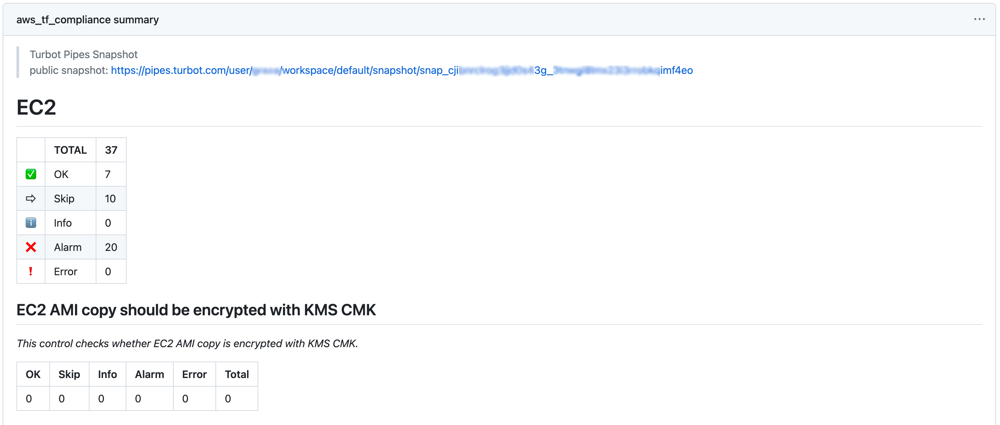
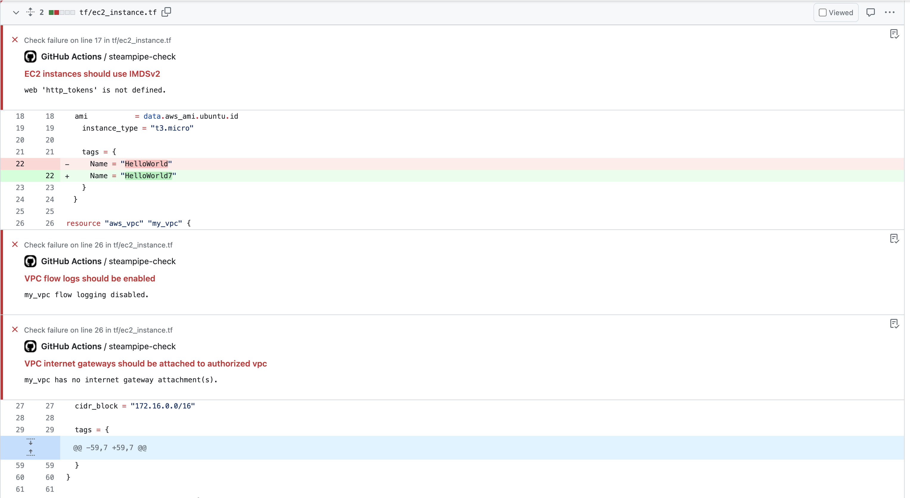

# Steampipe Check Action for GitHub Actions

This GitHub Action runs [Steampipe](https://steampipe.io/) Checks (benchmarks/controls) from [Steampipe Mods](https://hub.steampipe.io/mods).

This action will produce an easy to read **Job Summary** as part of your workflow.



For a full list of configuration options and descriptions see [action.yml](action.yml).

## IaC Checks & Annotations

This mod also allows you to scan your Infrastructure as Code (IaC) files directly from your GitHub repository using your workflow pipeline. This helps to identify potential security vulnerabilities, compliance issues, and infrastructure misconfigurations early in the development cycle.

For controls that scan local files, like those in the [Terraform AWS Compliance mod](https://github.com/turbot/steampipe-mod-terraform-aws-compliance), annotations will be created for any controls in `alarm` in the workflow provided they have an [additional dimension](https://steampipe.io/docs/reference/mod-resources/control#additional-control-columns--dimensions) providing the file path and a start (& optionally end) line numbers in the following formats: `path/filename.ext:23` or `path/name.ext:23-25`.



For a list of IaC mods offered by Turbot, please see [IaC mods](https://hub.steampipe.io/mods?categories=iac)

> NOTE: In order to create the annotations, you may need to ensure that the GitHub token provided has the permissions to write under `Settings -> Actions -> Workflow Permissions`, alternatively you can pass the `pull-requests: write` and `checks: write` permissions to the `job` see [job permissions](https://docs.github.com/en/actions/using-jobs/assigning-permissions-to-jobs).

## Usage

> This action requires you set-up Steampipe in your workflow in advance of using it, the recommend approach would be to utilise the [turbot/steampipe-action-setup](https://github.com/turbot/steampipe-action-setup) action, however you can set this up manually if you prefer.

### Basic Example

In order to use this action, you will be required at a minimum to pass in the `mod-url` of the mod containing the controls you wish to use.

```yaml
  - name: Repository Checkout
    uses: actions/checkout@v3
  - name: Setup Steampipe
    uses: turbot/steampipe-action-setup@v1.5.0
    with:
      plugin-connections: |
        connection "terraform" {
          plugin = "terraform"
          paths  = [ "./**/*.tf" ]
        }
  - name: Run AWS compliance on Terraform resources
    uses: turbot/steampipe-action-check@v1.0.0
    with:
      mod-url: https://github.com/turbot/steampipe-mod-terraform-aws-compliance
```

_Refer to [terraform plugin docs](https://hub.steampipe.io/plugins/turbot/terraform#configuring-local-file-paths) for local file path configuration._

### Using a non-main branch of the mod

You can use code for a mod not yet currently on it's main (default) branch by passing the `mod-branch` input.

```yaml
  - name: Repository Checkout
    uses: actions/checkout@v3
  - name: Setup Steampipe
    uses: turbot/steampipe-action-setup@v1.5.0
    with:
      plugin-connections: |
        connection "terraform" {
          plugin = "terraform"
          paths  = [ "./**/*.tf" ]
        }
  - name: Run AWS compliance on Terraform resources
    uses: turbot/steampipe-action-check@v1.0.0
    with:
      mod-url: https://github.com/turbot/steampipe-mod-terraform-aws-compliance
      mod-branch: my-feature-branch
```

### Run specific benchmarks and/or controls with the `checks` input

```yaml
  - name: Repository Checkout
    uses: actions/checkout@v3
  - name: Setup Steampipe
    uses: turbot/steampipe-action-setup@v1.5.0
    with:
      plugin-connections: |
        connection "terraform" {
          plugin = "terraform"
          paths  = [ "./**/*.tf" ]
        }
  - name: Run AWS compliance on Terraform resources
    uses: turbot/steampipe-action-check@v1.0.0
    with:
      mod-url: https://github.com/turbot/steampipe-mod-terraform-aws-compliance
      checks: benchmark.s3 benchmark.kms control.ecs_task_definition_encryption_in_transit_enabled
```

Note: `checks` can also be passed as a multiline input:
```yaml
      checks: |
        benchmark.s3
        benchmark.kms
        control.ecs_task_definition_encryption_in_transit_enabled
```

_Refer to the benchmarks/controls available for your cloud provider [here](#helpful-links)._

### Running non-IaC Checks

Any mod which contains benchmarks/controls can be used with this GitHub Action, in the below example we're performing a CIS benchmark on our GitHub account.

> Note: In the below example we're passing in a PAT (personal access token) to use as our default workflow token may not have all the privileges/repo access we want to use for our checks.

```yaml
- name: Repository Checkout
  uses: actions/checkout@v3
- name: Steampipe Setup
  uses: turbot/steampipe-action-setup@v1.5.0
  with:
    plugin-connections: |
      connection "github" {
        plugin = "github"
        token  = "${{secrets.GH_PAT}}"
      }
- name: Steampipe Checks
  uses: turbot/steampipe-action-check@update-check-action
  with:
    mod-url: https://github.com/turbot/steampipe-mod-github-compliance
    checks: benchmark.cis_supply_chain_v100
```

### Creating snapshots on Turbot Pipes

> Note: This example assumes you have a [Turbot Pipes](https://turbot.com/pipes) account and have [generated an API token](https://turbot.com/pipes/docs/profile#tokens) stored as a secret `PIPES_TOKEN` available to your repository.

You can create snapshots on [Turbot Pipes](https://turbot.com/pipes) by passing in `snapshot-visibility`, valid values for this input are:
- `anyone_with_link` - creates a shareable link to view the snapshot.
- `workspace` - creates the snapshot in the default workspace, the location can be overriden using `--snapshot-location` in the `additional-args` input.

You will also need to ensure your workflow is authenticated to Turbot Pipes by either using the `pipes-token` input or setting the relevant [Environment Variables](https://steampipe.io/docs/reference/env-vars/steampipe_cloud_host) on or prior to this step.

```yaml
  - name: Repository Checkout
    uses: actions/checkout@v3
  - name: Setup Steampipe
    uses: turbot/steampipe-action-setup@v1.5.0
    with:
      plugin-connections: |
        connection "terraform" {
          plugin = "terraform"
          paths  = [ "./**/*.tf" ]
        }
  - name: Run AWS compliance on Terraform resources
    uses: turbot/steampipe-action-check@v1.0.0
    with:
      mod-url: https://github.com/turbot/steampipe-mod-terraform-aws-compliance
      snapshot-visibility: workspace
      pipes-token: ${{ secrets.PIPES_TOKEN }}
```

### Passing variables into the mod

Some mods allow for passing in variables, one example is the [Kubernetes Compliance mod](https://github.com/turbot/steampipe-mod-kubernetes-compliance/blob/f9f1b7048866cfc85dd826a6ab3c930174e13331/mod.sp#L10-L20).

In this mod, we would like to have the `path` in the `common_dimensions` variable so that we can take advantage of it for the [annotations](#iac-checks--annotations).

You can set this by passing an environment variable in the format `SP_VAR_<mod-variable-name>`.

```yaml
  - name: Repository Checkout
    uses: actions/checkout@v3
  - name: Setup Steampipe
    uses: turbot/steampipe-action-setup@v1.5.0
    with:
      plugin-connections: |
        connection "k8s" {
          plugin = "kubernetes"
          manifest_file_paths  = ["k8s/*.yaml"]
          source_type = "manifest"
        }
  - name: Run K8s compliance on manifest files
    uses: turbot/steampipe-action-check@v1.0.0
    env:
      SP_VAR_common_dimensions: '["namespace", "path", "source_type"]'
    with:
      mod-url: https://github.com/turbot/steampipe-mod-kubernetes-compliance
```

Alternatively, we can pass the `--var` flag in the `additional-args` input.

```yaml
  - name: Repository Checkout
    uses: actions/checkout@v3
  - name: Setup Steampipe
    uses: turbot/steampipe-action-setup@v1.5.0
    with:
      plugin-connections: |
        connection "k8s" {
          plugin = "kubernetes"
          manifest_file_paths  = ["k8s/*.yaml"]
          source_type = "manifest"
        }
  - name: Run K8s compliance on manifest files
    uses: turbot/steampipe-action-check@v1.0.0
    with:
      mod-url: https://github.com/turbot/steampipe-mod-kubernetes-compliance
      additional-args: "--var 'common_dimensions=[\"namespace\", \"path\", \"source_type\"]'"
```

### Running AWS Compliance Checks

The below example assumes you've setup [OIDC](https://aws.amazon.com/blogs/security/use-iam-roles-to-connect-github-actions-to-actions-in-aws/) and configured permissions to assume a specific IAM role saved as a secret `AWS_IAM_ROLE`.

> Note: In order to use OIDC we need to elevate the permission for `id-token` to `write` as per these [docs](https://docs.github.com/en/actions/deployment/security-hardening-your-deployments/configuring-openid-connect-in-amazon-web-services#adding-permissions-settings)


```yaml
steps:
  - name: Repository Checkout
    uses: actions/checkout@v3
  - name: Setup AWS Credentials
    uses: aws-actions/configure-aws-credentials@v4
    with:
      role-to-assume: ${{secrets.AWS_IAM_ROLE}}
      aws-region: us-east-1
  - name: Steampipe Setup
    uses: turbot/steampipe-action-setup@v1.5.0
    with:
      plugin-connections: |
        connection "aws" {
          plugin = "aws"
        }
  - name: Steampipe Checks
    uses: turbot/steampipe-action-check@v1.0.0
    with:
      mod-url: https://github.com/turbot/steampipe-mod-aws-compliance
      checks: benchmark.cis_v200
```

_Refer to the benchmarks/controls available for AWS Compliance [here](https://hub.steampipe.io/mods/turbot/aws_compliance/controls)._

### Comprehensive Example

```yaml
name: Kubernetes Compliance Checks
on:
  pull_request:
    types: [opened, reopened]
    branches: ["main"]
    paths:
      - k8s/*

jobs:
  k8s_compliance_checks:
    runs-on: ubuntu-latest
    steps:
      - name: Repository Checkout
        uses: actions/checkout@v3
      - name: Steampipe Setup
        uses: turbot/steampipe-action-setup@v1.5.0
        with:
          plugin-connections: |
            connection "k8s" {
              plugin = "kubernetes"
              manifest_file_paths  = ["k8s/*.yaml"]
              source_type = "manifest"
            }
      - name: Steampipe Checks K8s Compliance
        uses: turbot/steampipe-action-check@v1.0.0
        env:
          SP_VAR_common_dimensions: '["connection_name", "context_name", "namespace", "path", "source_type"]' # Include path dimension for annotations.
        with:
          mod-url: https://github.com/turbot/steampipe-mod-kubernetes-compliance
          mod-branch: main 
          checks: all
          snapshot-visibility: anyone_with_link 
          pipes-token: ${{ secrets.PIPES_TOKEN }} 
          artifact-exports: csv,json,html,md 
          github-token: ${{ secrets.MY_GITHUB_TOKEN }} 
          additional-args: "--output=none" 
```

## Advanced Examples

### Using a Turbot Pipes workspace

You can execute the querying via Turbot Pipes, which is useful if you do not wish to store credentials in GitHub for all your plugin connections.

The below example shows how to configure an [implicit workspace](https://steampipe.io/docs/managing/workspaces#implicit-workspaces) within the `additional-args` input.

```yaml
steps:
  - name: Repository Checkout
    uses: actions/checkout@v3
  - name: Steampipe Setup
    uses: turbot/steampipe-action-setup@v1.5.0
    with:
      plugin-connections: |
        connection "aws" {
          plugin = "aws"
        }
  - name: Steampipe Checks
    uses: turbot/steampipe-action-check@v1.0.0
    with:
      mod-url: https://github.com/turbot/steampipe-mod-aws-compliance
      pipes-token: ${{ secrets.PIPES_TOKEN }}
      snapshot-visibility: workspace 
      additional-args: '--workspace="username/default"' # The workspace passed here in format <owner>/<workspace> needs to be accessible by your pipes-token.
```

Note: you can also set this as the `STEAMPIPE_WORKSPACE` environment variable.

```yaml
  - name: Steampipe Checks
    uses: turbot/steampipe-action-check@v1.0.0
    env:
      STEAMPIPE_WORKSPACE: 'username/default'
    with:
      mod-url: https://github.com/turbot/steampipe-mod-aws-compliance
      pipes-token: ${{ secrets.PIPES_TOKEN }}
      snapshot-visibility: workspace
```


### Use the action multiple times to scan multi-cloud Terraform resources in the same job

You can utilise this action multiple times in the same workflow, there are a couple of approaches to doing so.

The first approach is to explicitly repeat the step and change the parameters.

```yaml
  - name: Repository Checkout
    uses: actions/checkout@v3
  - name: Setup Steampipe
    uses: turbot/steampipe-action-setup@v1.5.0
    with:
      plugin-connections: |
        connection "aws_tf" {
          plugin = "terraform"
          paths  = [ 
            "cloud_infra/service_billing/aws/**/*.tf", 
            "cloud_infra/service_orders/aws/**/*.tf" 
          ]
        }

        connection "gcp_tf" {
          plugin = "terraform"
          paths  = [ 
            "cloud_infra/service_billing/gcp/**/*.tf", 
            "cloud_infra/service_orders/gcp/**/*.tf"
          ]
        }
  - name: Run Steampipe Terraform Compliance on AWS
    uses: turbot/steampipe-action-check@v1.0.0
    with:
      mod-url: https://github.com/turbot/steampipe-mod-terraform-aws-compliance
  - name: Run Steampipe Terraform Compliance on GCP
    uses: turbot/steampipe-action-check@v1.0.0
    with:
      mod-url: https://github.com/turbot/steampipe-mod-terraform-gcp-compliance
      additional-args: '--search-path-prefix=gcp_tf'
```

The second approach would be to configure a matrix strategy which will run the step once per matrix item.

```yaml
jobs:
  steampipe-terraform-compliance:
    strategy:
      matrix:
        include:
          - cloud: "aws"
            search_path: "aws_tf"
          - cloud: "azure"
            search_path: "azure_tf"
          - cloud: "gcp"
            search_path: "gcp_tf"
    runs-on: ubuntu-latest
    steps:
      - name: Check out repository
        uses: actions/checkout@v3
      - name: Setup Steampipe
        uses: turbot/steampipe-action-setup@v1.5.0
        with:
          plugin-connections: |
            connection "aws_tf" {
              plugin = "terraform"
              paths  = ["cloud_infra/terraform/aws/**/*.tf"]
            }
            connection "gcp_tf" {
              plugin = "terraform"
              paths  = ["cloud_infra/terraform/gcp/**/*.tf"]
            }
            connection "azure_tf" {
              plugin = "terraform"
              paths  = ["cloud_infra/terraform/azure/**/*.tf"]
            }
      - name: Run Steampipe Terraform Compliance - ${{ matrix.cloud }}
        uses: turbot/steampipe-action-check@v1.0.0
        with:
          mod-url: 'https://github.com/turbot/steampipe-mod-terraform-${{ matrix.cloud }}-compliance'
          additional-args: '--search-path-prefix=${{ matrix.search_path }}'
```

## Helpful links

- [Steampipe docs](https://steampipe.io/docs)
- [Steampipe plugins](https://hub.steampipe.io/plugins)
- [Steampipe mods](https://hub.steampipe.io/mods)
